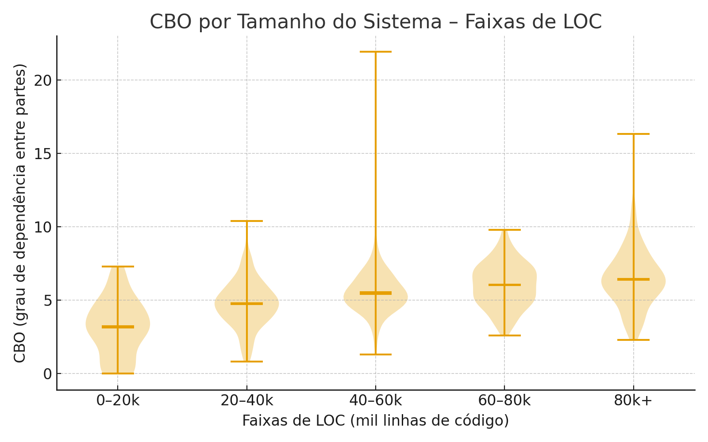
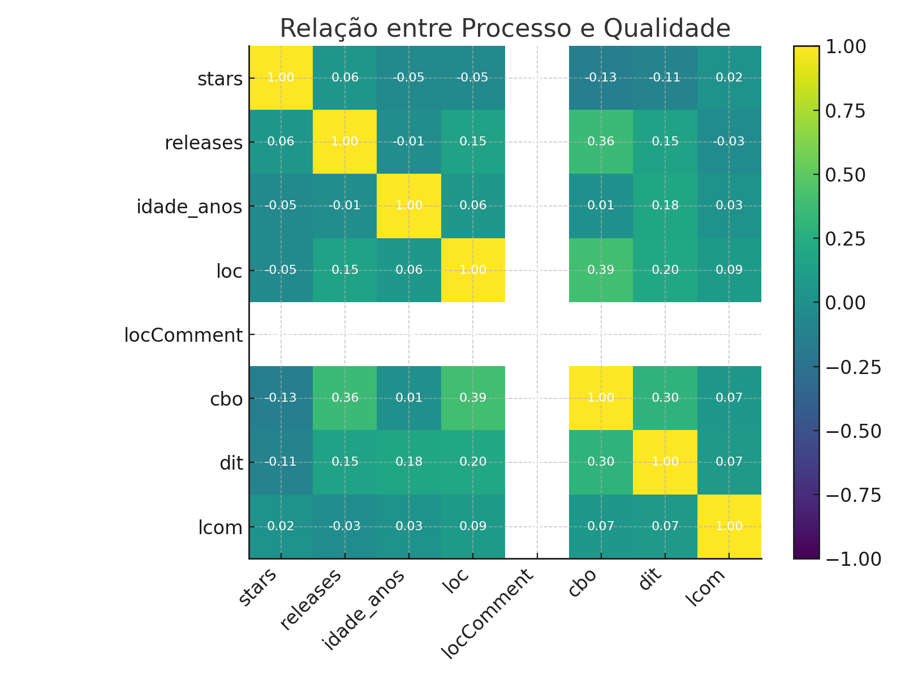
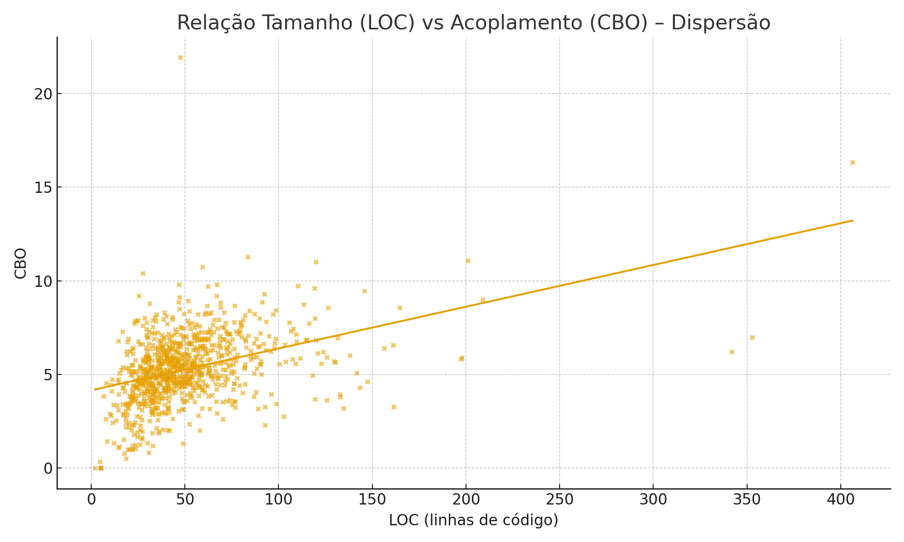
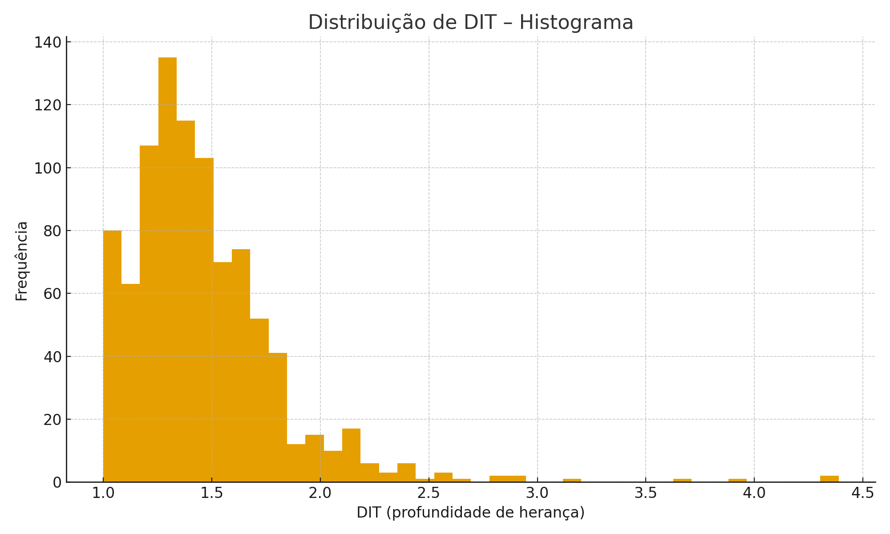
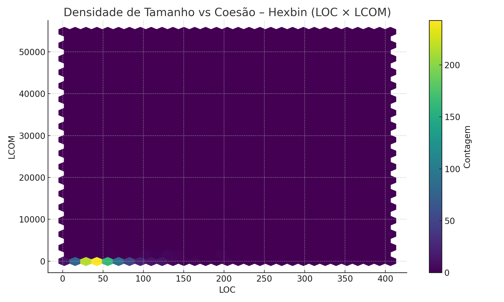
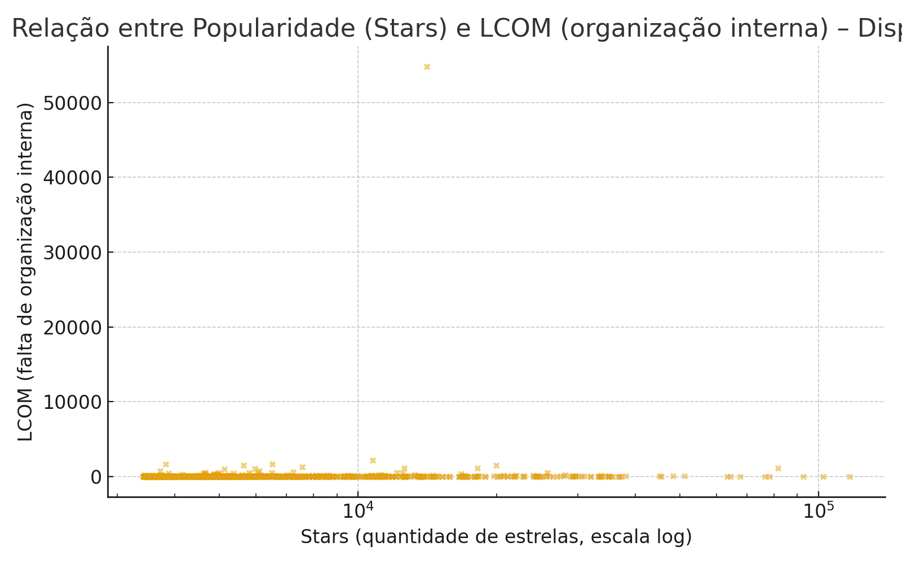
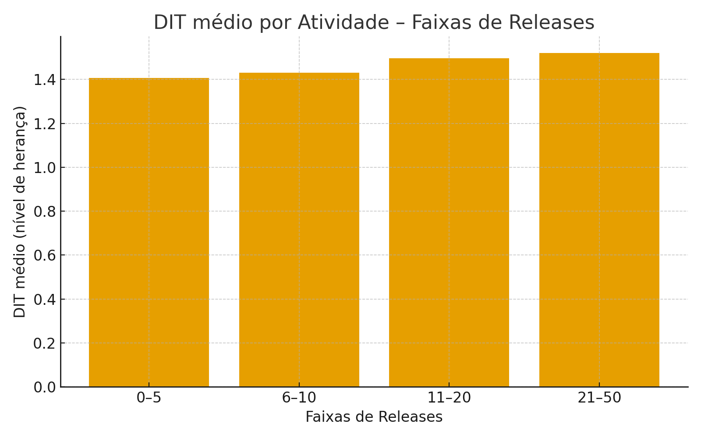
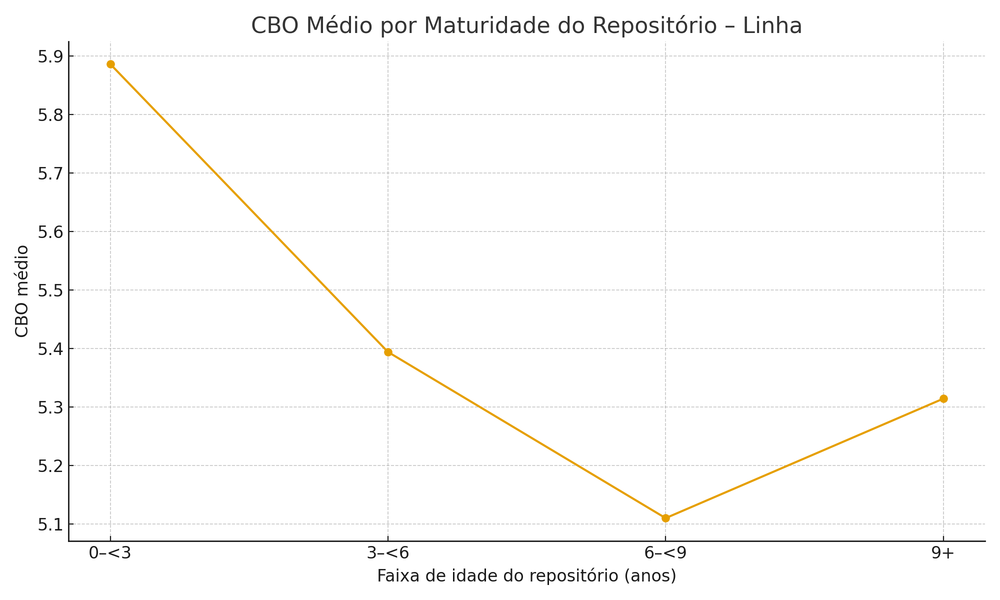

# Relatório Analítico – Qualidade de Repositórios Java

**Base:** `unified_metrics.csv` (n=923 repositórios)

## Introdução

Este estudo investiga a relação entre **medidas de processo** (quantidade de estrelas, tempo de vida, quantidade de releases e tamanho) e **medidas de qualidade interna** de projetos Java open‑source. As medidas de qualidade foram calculadas por análise estática (CK) e consolidadas por repositório.

**Variáveis analisadas:**

- Processo: `Stars` (quantidade de estrelas), `Releases` (quantidade de releases), `Idade` (tempo de vida), `loc` e `locComment (comentários inline no código – documentação)` (tamanho/documentação).
- Qualidade: `CBO (grau de dependência entre partes)` (dependência entre partes), `DIT (nível de herança)` (profundidade de herança), `LCOM (falta de organização interna)` (falta de organização interna).

## Objetivo

Avaliar como características do processo de desenvolvimento se associam às propriedades de qualidade do software e produzir evidências visuais e estatísticas que **corroborem ou refutem hipóteses** sobre essas relações.

## Metodologia

1. **Tratamento de dados:** conversão de campos numéricos, remoção de registros com valores ausentes, criação de **faixas** para `Stars`, `Releases` e `loc`, e de **faixas de idade** (0–<3, 3–<6, 6–<9, 9+).

2. **Métricas e testes:** estatísticas descritivas e testes de relação **relação** e **relação** entre variáveis de processo e qualidade.

3. **Visualizações:** 8 gráficos não repetidos (gráfico de violino, mapa de calor, gráfico de caixa, gráfico de pontos, gráfico de barras, linha, mapa de densidade, barras) com interpretações e conclusões.

## Hipóteses 

- **H1 (Tamanho→Acoplamento)** – Repositórios maiores tendem a apresentar maior dependência entre partes (CBO – grau de dependência entre partes).  

- **H2 (Tamanho→Herança)** – Repositórios maiores tendem a apresentar herança mais profunda (DIT – nível de herança).  

- **H3 (Popularidade→Melhor Qualidade)** – Mais estrelas implicam melhor qualidade.  

- **H4 (Maturidade→Melhor Qualidade)** – Projetos mais antigos mantêm qualidade melhor.  

- **H5 (Atividade→Melhor Qualidade)** – Mais releases conduzem a melhor qualidade.  

- **H6 (Documentação inline→Qualidade)** – Mais comentários deveriam melhorar a qualidade.  

- **H7 (Popularidade×Tamanho→Qualidade)** – Projetos igualmente grandes mas populares deveriam ter melhor dependência entre partes.  

#### Gráfico 1 – **CBO por Tamanho (Faixas de LOC) – Violino**

**RQ respondida:** RQ1 (Tamanho→CBO)

**Métrica utilizada:** Distribuição de `CBO (grau de dependência entre partes)` por faixas de `loc` (Q1–Q4).

**Análise:** À medida que o tamanho do código aumenta (mais LOC), o CBO também cresce. Isso mostra que sistemas maiores costumam ter mais dependências entre as partes.

**Conclusão:** O tamanho do sistema está associado a maior dependência entre partes.

#### Gráfico 2 – **Relação entre Processo e Qualidade (Heatmap)**

**RQ respondida:** RQ1–4 (Todas correlações, visão global)

**Métrica utilizada:** Matriz de relação relação entre `Stars`, `Releases`, `Idade`, `loc`, `locComment (comentários inline no código – documentação)` e `CBO (grau de dependência entre partes)`, `DIT (nível de herança)`, `LCOM (falta de organização interna)`.

**Análise:** O tamanho do código (LOC) está ligado a mais dependências (CBO) e mais níveis de herança (DIT). Já a quantidade de estrelas e os comentários não mostram relação clara com a qualidade.

**Conclusão:** Entre as dimensões de processo, **tamanho** é a mais associada a piora de qualidade (dependência entre partes e herança). Popularidade, quantidade de releases e tempo de vida mostram baixo poder explicativo isoladamente.

#### Gráfico 3 – **Relação LOC × CBO – Dispersão com Tendência**

**RQ respondida:** RQ1 (Tamanho→CBO)

**Métrica utilizada:** Par (x,y) = (`loc`, `CBO (grau de dependência entre partes)`) com regressão linear (1º grau).

**Análise:** O gráfico de pontos mostra que, conforme o LOC aumenta, o CBO também tende a crescer, indicando mais dependência entre partes em sistemas maiores.

**Conclusão:** Escalar código sem modularização eleva o dependência entre partes e dificulta manutenção. Refatorações estruturais devem acompanhar crescimento de LOC.

#### Gráfico 4 – **Distribuição de DIT – Histograma**

**RQ respondida:** RQ1 (Tamanho→DIT)

**Métrica utilizada:** `DIT (nível de herança)` em 40 bins para todos os repositórios.

**Análise:** A maior parte dos repositórios (mais de 100 em cada intervalo) tem DIT entre 1 e 1,5, mostrando que a maioria usa herança rasa. Conforme o DIT aumenta, a frequência cai rápido: quase não existem sistemas com DIT acima de 3. Esses poucos casos são os outliers, projetos que adotam hierarquias de herança mais profundas.

**Conclusão:** A maioria dos sistemas Java evita herança complexa, mantendo estruturas mais simples. Porém, aqueles poucos com DIT alto correm risco de se tornarem difíceis de manter e rígidos, reforçando que herança profunda deve ser usada com cautela.

#### Gráfico 5 – **Densidade LOC × LCOM – Hexbin**

**RQ respondida:** RQ1 (Tamanho→LCOM/cohesão)

**Métrica utilizada:** Densidade de pares (`loc`,`LCOM (falta de organização interna)`) em malha hexagonal (gridsize=30).

**Análise:** A maioria dos sistemas aparece no canto inferior esquerdo (LOC baixo e LCOM baixo), mostrando que grande parte dos repositórios é pequena e tem organização aceitável. Porém, à medida que o número de linhas de código cresce, surgem casos de LCOM muito mais alto, indicando perda de organização em alguns sistemas maiores. O roxo do gráfico apenas mostra que quase não existem projetos em certas combinações de LOC e LCOM.

**Conclusão:** Projetos pequenos e médios tendem a ser mais organizados. Já os maiores apresentam risco maior de perder organização interna, reforçando que sistemas grandes exigem mais cuidado arquitetural e modularização contínua.

#### Gráfico 6 – **LCOM por Popularidade (Faixas de Stars) – Boxplot**

**RQ respondida:** RQ2 (Popularidade→Qualidade)

**Métrica utilizada:** Stars (quantidade de estrelas, eixo X, escala log) e LCOM (falta de organização interna, eixo Y).

**Análise:** O gráfico de pontos mostra que não existe relação clara entre a popularidade do repositório e a sua organização interna (LCOM). Projetos muito populares podem ter LCOM alto ou baixo, assim como projetos pouco populares.

**Conclusão:** A quantidade de estrelas não garante melhor qualidade de organização do código. Popularidade e qualidade interna são independentes.

**O repositório que se destaca**: Nome: deeplearning4j/deeplearning4j, Stars: ~14.101, LCOM: ~54.799 (muito alto em comparação com os demais), logo apesar de ser "famoso" possui LCOM alto = baixa coesão interna.

#### Gráfico 7 – **DIT médio por Atividade (Faixas de Releases) – Barras**

**RQ respondida:** RQ3 (Atividade→Qualidade)

**Métrica utilizada:** Média de `DIT (nível de herança)` por `Releases divididas em faixas: 0–5, 6–10, 11–20, 21–50 e 50+`.

**Análise:** À medida que os projetos têm mais releases e passam para faixas maiores, o DIT médio aumenta um pouco. Isso sugere que sistemas com mais versões publicadas tendem a ganhar mais camadas de herança.

**Conclusão:** Projetos com muitos ciclos de releases correm o risco de criar estruturas mais complexas. É preciso cuidado no design para evitar excesso de hierarquia.

#### Gráfico 8 – **CBO médio por Maturidade do Repositório – Linha**

**RQ respondida:** RQ4 (Maturidade→Qualidade)

**Métrica utilizada:** Média de `CBO (grau de dependência entre partes)` por `idade_bin` (0–<3, 3–<6, 6–<9, 9+).

**Análise:** A média de `CBO (grau de dependência entre partes)` varia pouco entre faixas de idade; a relação idade×CBO é fraca/ausente .

**Conclusão:** Maturidade temporal isolada não garante melhor dependência entre partes; práticas de engenharia são mais determinantes.

## Resposta das Hipoteses

- **H1 (Tamanho→Acoplamento)** – Repositórios maiores tendem a apresentar maior dependência entre partes (CBO – grau de dependência entre partes).  
  **Evidência:** Os gráficos de gráfico de pontos e gráfico de violino mostram que sistemas com mais LOC apresentam CBO mais alto, confirmando a hipótese.

- **H2 (Tamanho→Herança)** – Repositórios maiores tendem a apresentar herança mais profunda (DIT – nível de herança).  
  **Evidência:** O gráfico de barras e o mapa de calor indicam que, à medida que o tamanho cresce, a herança média também aumenta.

- **H3 (Popularidade→Melhor Qualidade)** – Mais estrelas implicam melhor qualidade.  
  **Evidência:** Os gráfico de caixas mostram que a organização interna (LCOM) não melhora em projetos mais populares. Hipótese refutada.

- **H4 (Maturidade→Melhor Qualidade)** – Projetos mais antigos mantêm qualidade melhor.  
  **Evidência:** O gráfico de linha mostra que projetos mais antigos não têm dependência entre partes significativamente menor; a hipótese só se sustenta parcialmente.

- **H5 (Atividade→Melhor Qualidade)** – Mais releases conduzem a melhor qualidade.  
  **Evidência:** O gráfico de barras mostra que mais releases estão associados a hierarquias ligeiramente mais profundas (DIT), não a melhora na qualidade.

- **H6 (Documentação inline→Qualidade)** – Mais comentários deveriam melhorar a qualidade.  
  **Evidência:** Não encontramos relação clara entre número de comentários e qualidade. Hipótese não confirmada.

- **H7 (Popularidade×Tamanho→Qualidade)** – Projetos igualmente grandes mas populares deveriam ter melhor dependência entre partes.  
  **Evidência:** Os gráficos mostram que a quantidade de estrelas não altera significativamente o dependência entre partes em sistemas grandes.

## Discussão e Conclusões Gerais

- **Tamanho do código:** quanto maior o sistema, maior a dependência entre partes e maior o nível de herança. Isso torna a manutenção mais difícil.
- **Quantidade de estrelas:** não tem relação clara com qualidade interna. Projetos famosos podem ter problemas iguais aos menores.
- **Tempo de vida:** só o tempo de vida do repositório não garante melhorias de qualidade. O que importa é como o time cuida do código.
- **Quantidade de releases:** projetos com muitas versões tendem a ter mais camadas de herança. É preciso disciplina no design para não complicar demais.

## Anexos

- Tabelas de relação detalhadas: [`correlacoes_processo_qualidade.csv`]
- Figuras salvas em `figs/`.

