# Relatório – Qualidade de Repositórios

## Introdução e hipóteses informais

- **RQ01 (Popularidade ⇔ Qualidade):** hipótese: repositórios mais populares (mais estrelas) tendem a apresentar maior qualidade (menor acoplamento, maior coesão).  
- **RQ02 (Maturidade ⇔ Qualidade):** hipótese: repositórios mais antigos são mais estáveis, com métricas de qualidade mais controladas.  
- **RQ03 (Atividade ⇔ Qualidade):** hipótese: projetos mais ativos (mais releases) mantêm qualidade melhor.  
- **RQ04 (Tamanho ⇔ Qualidade):** hipótese: LOC maiores tendem a elevar o acoplamento (CBO) e a complexidade (DIT, LCOM).  

---

## Metodologia

1. Métricas de **processo** por repositório: estrelas (popularidade), idade em anos (maturidade), número de releases (atividade), LOC e comentários (tamanho).  
2. Métricas de **qualidade**: CBO (acoplamento), DIT (profundidade de herança), LCOM (coesão).  
3. Consolidação em `unified_metrics.csv`.  
4. Visualização por boxplots, ECDFs, scatterplots e hexbin.  

---

## Resultados e discussão

### RQ01 – Popularidade e Qualidade

- Poucos projetos muito populares, maioria com poucas estrelas.  
- A relação entre estrelas e métricas de qualidade é **fraca**, mas os outliers de popularidade não significam maior qualidade.  

**Gráficos**:  
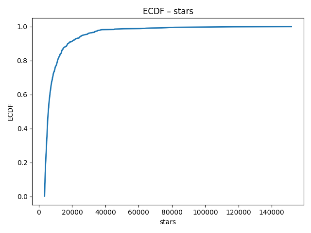  
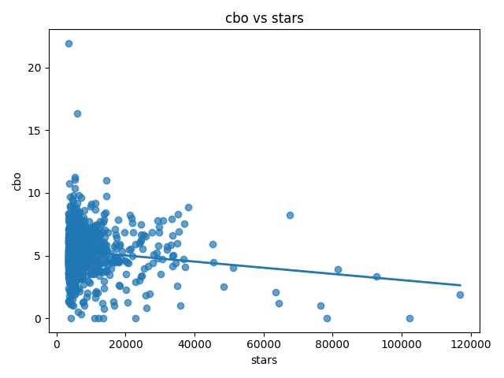  
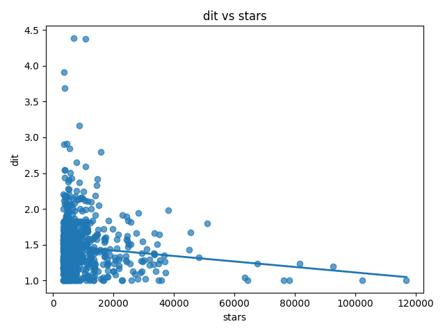  
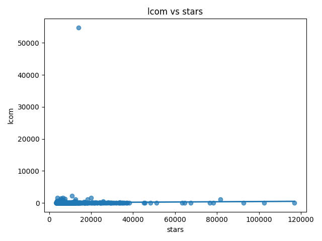  

---

### RQ02 – Maturidade e Qualidade

- Distribuição de idades sugere muitos projetos entre 5–15 anos.  
- Tendência suave: repositórios mais antigos **não apresentam melhora clara** nas métricas (CBO, DIT, LCOM).  

**Gráficos**:  
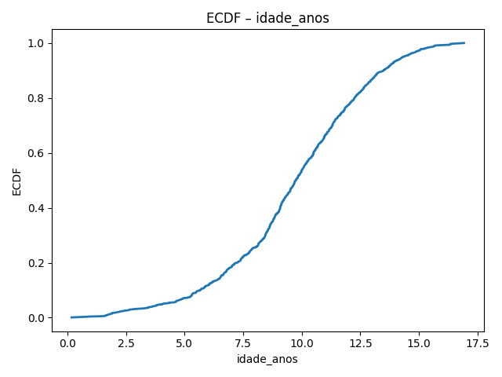  
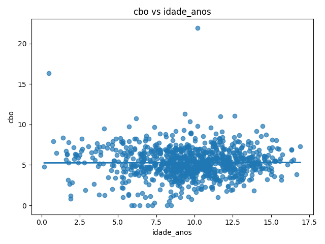  
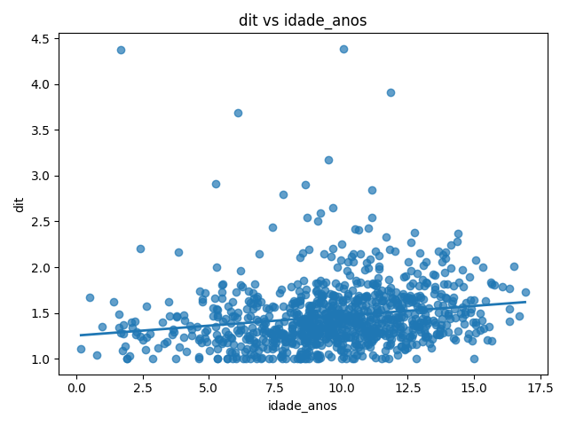  
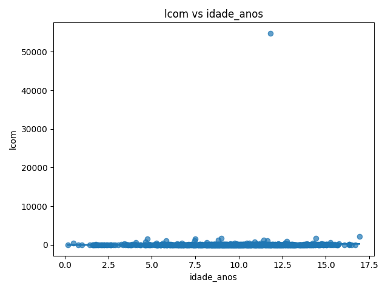  

---

### RQ03 – Atividade e Qualidade

- Muitos projetos têm poucas releases; poucos são muito ativos.  
- Qualidade parece **independente da atividade**, mas há indícios de CBO e DIT levemente maiores em projetos com mais releases.  

**Gráficos**:  
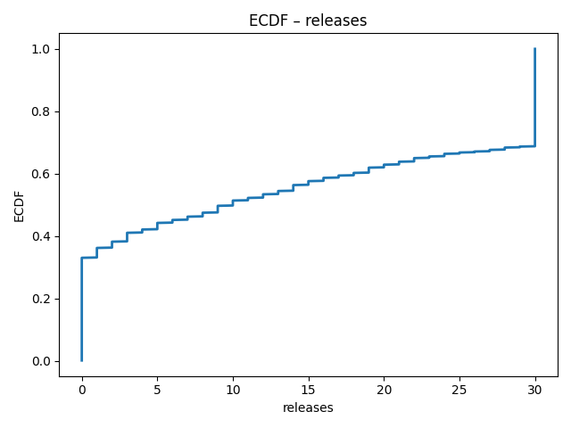  
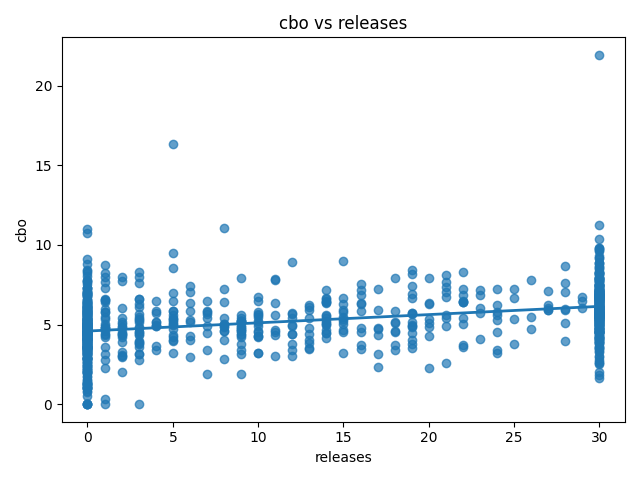  
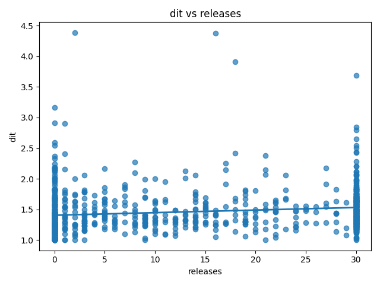  
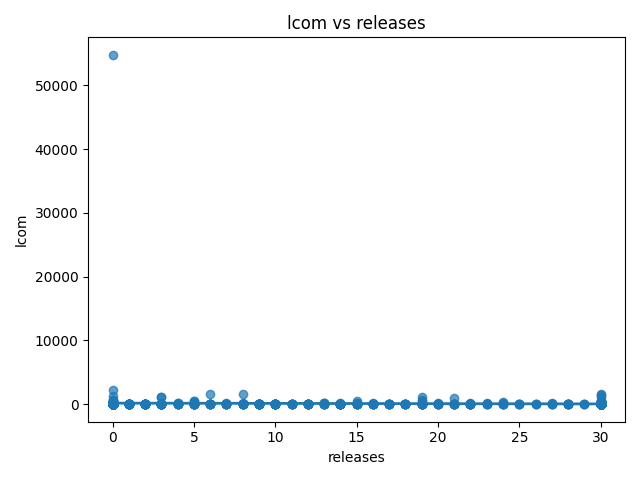  

---

### RQ04 – Tamanho e Qualidade

- Projetos pequenos predominam (poucos LOC).  
- Repositórios maiores tendem a apresentar **maior acoplamento (CBO)** e **maior profundidade de herança (DIT)**.  
- LCOM mostra muitos outliers, sugerindo baixa coesão em projetos grandes.  

**Gráficos**:  
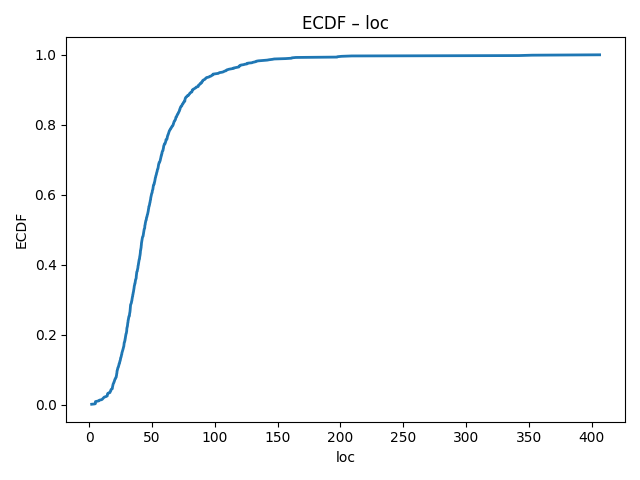  
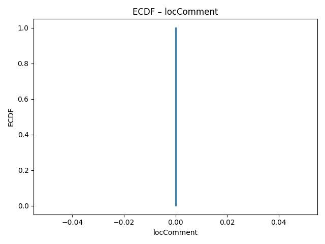  
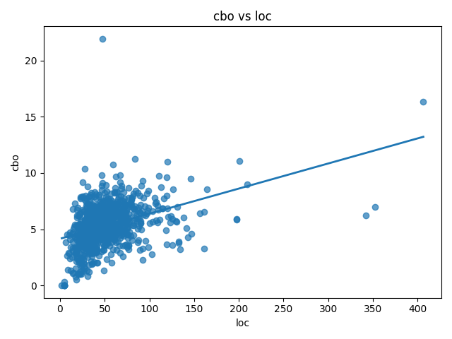  
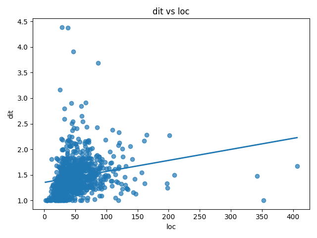  
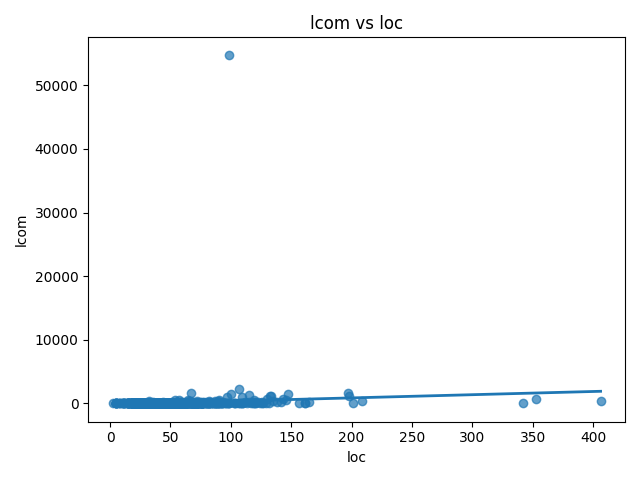  

---

## Conclusão

- **RQ01:** Popularidade não garante qualidade.  
- **RQ02:** Maturidade (idade) não mostra tendência clara de melhor qualidade.  
- **RQ03:** Atividade (releases) também não apresenta correlação forte.  
- **RQ04:** Tamanho é a dimensão mais associada ao aumento de CBO e DIT, sugerindo impacto negativo na manutenibilidade.  

---

## Integrantes

- Augusto Noronha Leite  
- Pedro Maximo  
- David Leong Ho  
